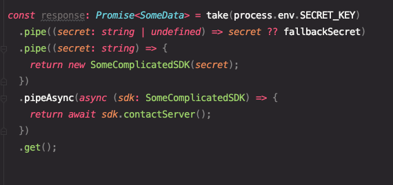

# take 'n pipe

Simple tool to seamlessly chain code execution.

[](https://choosealicense.com/licenses/mit/)



## Features

- 😝 Ridiculously simple.
- ⚙️ Sync & async context.
- 📦 Distributions in ESM and CommonJS standards.
- 📘 Full TypeScript support.
- 🔋 Bateries included - no dependencies.
- 🧪 Well tested with Jest.

## Installation

```bash
  # With NPM
  npm install take-n-pipe

  # With Yarn
  yarn add take-n-pipe
```

## Usage

1. Take any input data.

```ts
take(data)
```

2. Transform data with the `pipe(...)` method.

```ts
.pipe((data: object) => JSON.stringify(data))
```

3. \[Optionally] Jump to asynchronous context easily.

```ts
.pipeAsync(async (json: string) => {
    return await server.send(json);
})
```

> Note that if you are using asynchronous context you should await on the chain result.
>
> `await take(...).pipeAsync(...).get()`

4. Obtain results.

```
.get()
```

## Full example

```ts
const response: SomeData = await take(process.env.SECRET_KEY)
  .pipe((secret: string | undefined) => secret ?? fallbackSecret)
  .pipe((secret: string) => {
    return new SomeComplicatedSDK(secret);
  })
  .pipeAsync(async (sdk: SomeComplicatedSDK) => {
    return await sdk.contactServer();
  })
  .get();
```

## TODO

- [X] Write some tests.
- [ ] Implement new `Pipe.catch(...)` method.
- [ ] Allow merging two `Pipe`'s together somehow.
- [ ] (Optionally) Setup CI/CD to look for TS, ESLint, Jest issues.
