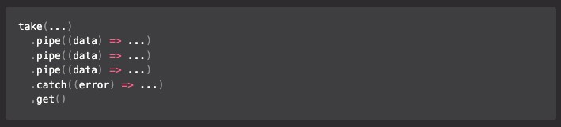

# take 'n pipe

Simple tool to seamlessly chain code execution.

[](https://choosealicense.com/licenses/mit/)



## Why `take 'n pipe`?

* Easy way to process data in a **linear** and **readable** manner.
* You are **not polluting current scope** with unnecessary, single use variables.
* **Catch errors predictably**, at any point in a chain, instead of nesting multiple try-catch clauses. 
* You can start processing your data synchronously and proceed to the **asynchronous context** at any point.

## Features

- 😝 Ridiculously simple.
- ⚙️ Sync & async context.
- 📦 Distributions in ESM and CommonJS standards.
- 📘 Full TypeScript support.
- 🔋 Bateries included - no dependencies.
- 🧪 Well tested with Jest.

## Installation

```bash
  # With NPM
  npm install take-n-pipe

  # With Yarn
  yarn add take-n-pipe
```

## The way you go

### Sync pipes

1. Take any input data.

```ts
take(data)
```

2. Transform data with the `pipe(...)` method as many times as you want.

```ts
.pipe((data: object) => {...})
```

3. [Optionally] Catch errors with `catch(...)` method at any time.

```ts
.catch((error: unknown) => {...})
```

4. Obtain results.

```
.get()
```

### Async pipes

1. Take any input data.

```ts
takeAsync(promise)
```

2. Transform data with the `pipeAsync(...)` method as many times as you want.

```ts
.pipeAsync(async (data: object) => {...})
```

3. [Optionally] Catch errors with `catchAsync(...)` method at any time.

```ts
.catchAsync((error: unknown) => {...})
```

4. Obtain results as a Promise.

```
.toPromise()
```

### Mixed pipes

1. Start within sync context, take any input data.

```ts
take(data)
```

2. Being in sync context transform data with the `pipe(...)` method as many times as you want.

```ts
.pipe((data: object) => {...})
```

3. Call the `pipeAsync(...)` method to proceed to async context.

> By calling the `pipeAsync(...)` method on a synchronous chain, you turn it into an asynchronous chain from that point on.
> 
> This is a one-way ticket, there is no way to go back to the synchronous chain anymore.

```ts
.pipeAsync(async (data: object) => {...})
```

4. Obtain results as a Promise.

```
.toPromise()
```

## Examples

<details>
<summary>Sync chain</summary>

https://github.com/IdkMan2/take-n-pipe/blob/8a01d6223fa37f061db6074f09c7dd522d13e758/tests/examples/sync-pipes.ts#L14-L43
</details>

<details>
<summary>Mixed context chain</summary>

https://github.com/IdkMan2/take-n-pipe/blob/8a01d6223fa37f061db6074f09c7dd522d13e758/tests/examples/mixed-pipes.ts#L29-L66
</details>
